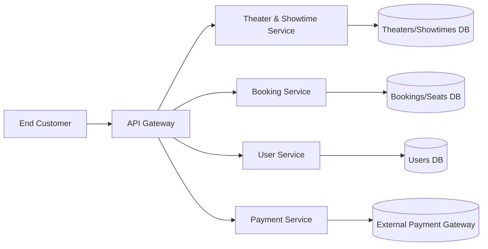
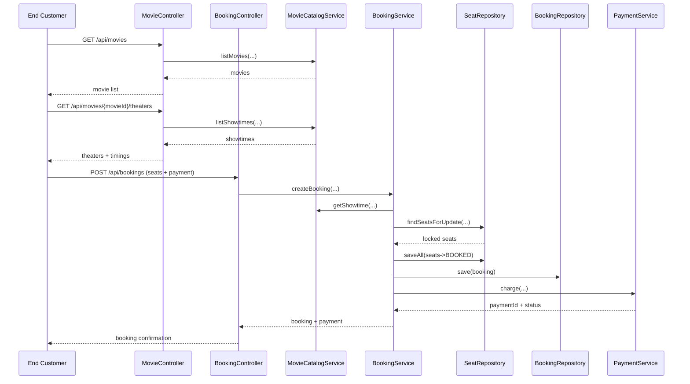

# XYZ Online Movie Booking Platform (Starter)

This is a **basic Spring Boot starter** for an online movie ticket booking platform. It is designed for B2C customers to browse movies by city, language, and genre and book seats in advance with a smooth flow.

## Recommended tech stack (beginner friendly)

**Core platform**
- **Language:** Java 8
- **Framework:** Spring Boot (REST API)
- **Database (future):** PostgreSQL or MySQL
- **Cache (future):** Redis (for seats + showtimes)
- **Integration:** REST + Webhooks for payments
- **Cloud (future):** AWS (ECS + RDS + S3) or Azure (App Service + SQL)

**AI suggestions (optional, later)**
- **Recommendation engine:** Suggest movies based on city/language/genre and user history.
- **Search assistant:** Natural language movie search ("Family movie in Chennai tonight").
- **Support bot:** Customer support assistant for refunds, cancellations, FAQs.

## What this starter includes

- **Controllers:** REST endpoints for movies and bookings.
- **Services:** In-memory browsing + transactional booking with an in-memory H2 database.
- **Models/DTOs:** Simple data objects for requests/responses.

## Project structure

```
src/main/java/com/xyz/moviebooking
├── MovieBookingApplication.java
├── controller
│   ├── BookingController.java
│   └── MovieController.java
├── dto
│   ├── BookingRequest.java
│   ├── BookingResponse.java
│   ├── MovieResponse.java
│   ├── ShowtimeResponse.java
│   └── TheaterShowtimesResponse.java
├── model
│   ├── Booking.java
│   ├── Movie.java
│   ├── Showtime.java
│   └── Theater.java
└── service
    ├── BookingService.java
    └── MovieCatalogService.java
```

## Architecture diagram (high level)

```mermaid
flowchart TD
    User[End Customer] -->|Browse movies, filters| MovieAPI[MovieController]
    User -->|Book tickets (theater + time + seats)| BookingAPI[BookingController]

    MovieAPI --> MovieService[MovieCatalogService]
    BookingAPI --> BookingService[BookingService]
    BookingService --> MovieService

    MovieService --> InMemoryData[(In-memory Movies & Showtimes)]
    BookingService --> InMemoryData

    InMemoryData --> FutureDB[(Future DB: PostgreSQL/MySQL)]
    BookingService --> Payments[(Future Payments)]
```

## Microservices architecture (suggested split)



## How the flow works (simple explanation)

1. **Browse movies**: `/api/movies` returns movies and supports filters like city, language, and genre.
2. **Scenario 1 - Browse theaters and timings**: `/api/movies/{movieId}/theaters?city=Delhi&date=2026-01-25` shows which theaters are playing the movie in a city on a chosen date.
3. **Scenario 2 - Book seats + payment**: `/api/bookings` accepts a theater, showtime, preferred seats, and payment details, then returns a confirmation with a payment reference.

All data is **in-memory** for now, so it’s easy to understand and replace later with a database.
The booking flow uses **transactional DB logic** on top of an in-memory H2 database to demonstrate safe seat locking.

## Sequence diagram (booking with payment)



## Quick start

```bash
mvn spring-boot:run
```

Open your browser or Postman and try:

- **Movies**: `GET http://localhost:8080/api/movies?city=Delhi&language=Hindi`
- **Theaters + timings**: `GET http://localhost:8080/api/movies/mov-101/theaters?city=Mumbai&date=2026-01-25`
- **Book**:

```bash
curl -X POST http://localhost:8080/api/bookings \
  -H "Content-Type: application/json" \
  -d '{\"showtimeId\": \"show-201\", \"theaterId\": \"theater-01\", \"customerName\": \"Asha\", \"seatNumbers\": [\"A1\", \"A2\"], \"paymentMethod\": \"CARD\", \"amount\": 500.0}'
```

## Next steps for a real system

- Add **database tables** for movies, theaters, showtimes, and bookings.
- Add **payment integration** (Stripe/Razorpay).
- Add **seat selection** and **locking** to avoid double booking.
- Add **user accounts**, **auth**, and **booking history**.
- Add **recommendation and search AI** to personalize experiences.

If you are new to Spring Boot, start with the controller classes and follow how they call the service classes. This is the core pattern used in real-world applications.
